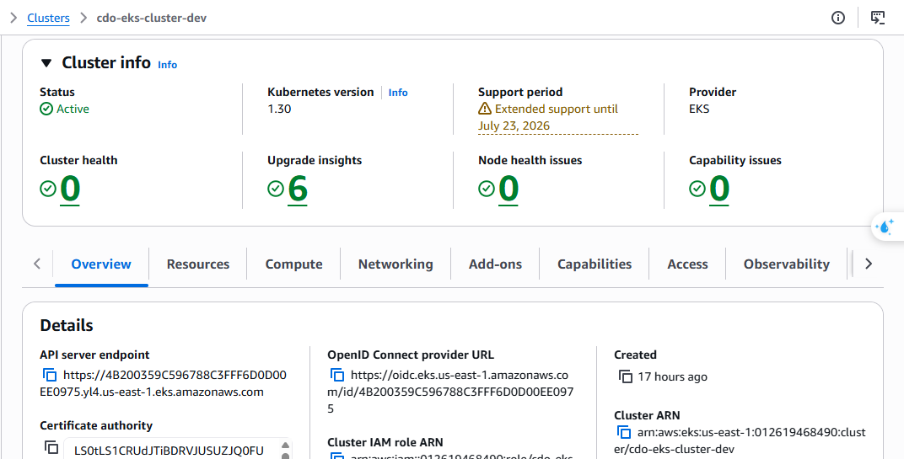
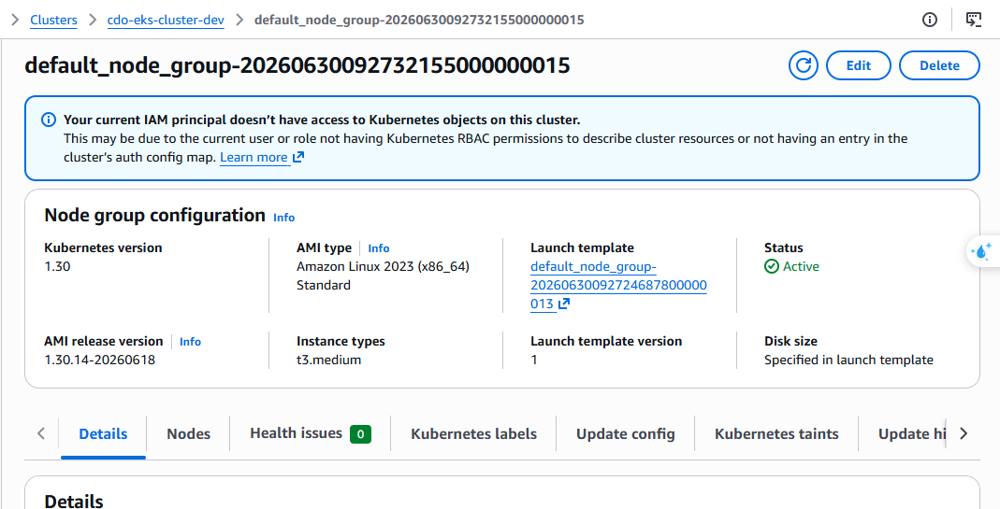
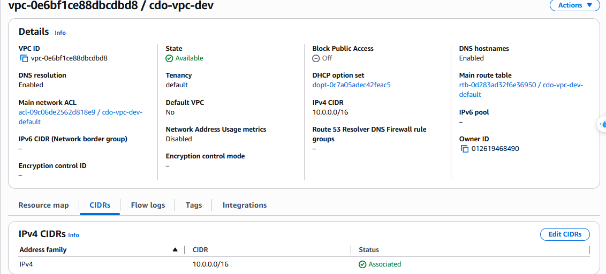
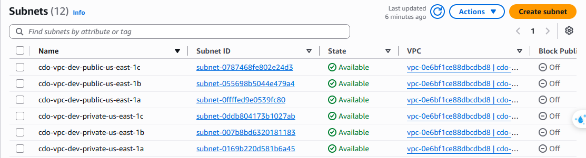
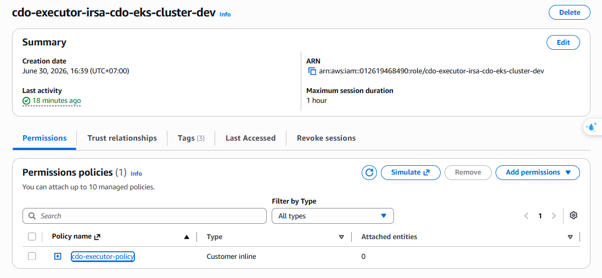

# 📋 Evidence Visual Proof — CDO-02 Task Force 3 Self-Heal Engine

> **Mục đích**: Tài liệu này tập hợp toàn bộ ảnh chụp màn hình (screenshot) từ AWS Console và các hệ thống liên quan, kèm giải thích chi tiết, nhằm **chứng minh hạ tầng đã được triển khai và vận hành thực tế** cho dự án CDO-02 Self-Heal Agent on AWS EKS.
>
> **Nguyên tắc**: Mỗi ảnh là một bằng chứng cụ thể. Ảnh + giải thích + liên kết với yêu cầu = evidence hoàn chỉnh cho reviewer.

---

## Mục Lục

1. [Hạ tầng Kubernetes (EKS)](#1-hạ-tầng-kubernetes-eks)
2. [Networking — VPC & Subnets](#2-networking--vpc--subnets)
3. [Bảo mật IAM — IRSA Roles](#3-bảo-mật-iam--irsa-roles)
4. [Audit Storage — S3 Object Lock](#4-audit-storage--s3-object-lock)
5. [Idempotency — DynamoDB](#5-idempotency--dynamodb)
6. [Trạng thái tổng thể](#6-trạng-thái-tổng-thể)

---

## 1. Hạ tầng Kubernetes (EKS)

### 1.1 EKS Cluster — Console Overview

**Giải thích:**
Ảnh chụp màn hình AWS Console tại **EKS → Clusters**, hiển thị cluster TF3 đang ở trạng thái **Active**. Có thể thấy Kubernetes version được sử dụng, endpoint URL của API server, và thời điểm cluster được tạo.

**Chứng minh điều gì:**
- Cluster EKS đã được khởi tạo thành công bằng Terraform IaC (module `infra/modules/eks/`).
- Cluster không dùng default VPC — là môi trường sandbox riêng biệt cho dự án.
- Đây là nền tảng để deploy CDO Executor, AI Engine, và toàn bộ workload của TF3.

**Liên kết với thiết kế:** Xem [ADR-001 — K8s-heavy angle](../audit_design_decision_v2.0.md) và template `02_infra_design.md`.

---

### 1.2 EKS Node Group — Compute Details

**Giải thích:**
Ảnh chụp tab **Compute** trong EKS Cluster Console, hiển thị Node Group với instance type `t3.medium`, trạng thái **Active**, cùng các thông số `desired`, `min`, `max` capacity.

**Chứng minh điều gì:**
- Cluster có ít nhất 2 worker nodes đang chạy, đủ để schedule các Pod của Executor và AI Engine trên các node riêng biệt.
- Node Group được cấu hình với capacity thủ công (không dùng Karpenter), phù hợp với môi trường sandbox có chi phí kiểm soát.
- Kết hợp với ảnh `eks-cluster-console.png`, chứng minh toàn bộ control plane + data plane đã sẵn sàng.

**Ghi chú kỹ thuật:** `t3.medium` (2 vCPU, 4 GB RAM) là mức tối thiểu để chạy Kyverno admission webhook + Executor + AI Engine đồng thời trong scope sandbox.

---

## 2. Networking — VPC & Subnets

### 2.1 VPC Console

**Giải thích:**
Ảnh chụp **VPC → Your VPCs** trong AWS Console, hiển thị VPC của dự án với CIDR block, tên VPC, và trạng thái. VPC này là **không phải Default VPC** (`Default VPC = No`), được tạo riêng cho môi trường sandbox.

**Chứng minh điều gì:**
- Hạ tầng mạng được tạo riêng biệt, không dùng chung default VPC, tuân thủ yêu cầu isolation.
- VPC là đơn vị network boundary ngoài cùng, chứa toàn bộ tài nguyên EKS, S3 Gateway Endpoint, DynamoDB Endpoint.
- Terraform module `infra/modules/vpc/` đã chạy thành công (`terraform apply` hoàn tất).

**Liên kết với thiết kế:** Template `03_security_design.md`, phần "Network policy — VPC topology: private subnets, NAT gateway, VPC endpoints".

---

### 2.2 Subnets Console

**Giải thích:**
Ảnh chụp **VPC → Subnets** được lọc theo VPC của dự án. Hiển thị danh sách các subnet public và private trải đều trên nhiều Availability Zone (`us-east-1a`, `us-east-1b`).

**Chứng minh điều gì:**
- Thiết kế **multi-AZ** được hiện thực hóa: EKS node group trải đều trên ít nhất 2 AZ, tăng tính sẵn sàng.
- Phân tách subnet public (NAT Gateway) và private (EKS nodes, Executor pods): tuân thủ nguyên tắc "không expose node trực tiếp ra internet".
- VPC Gateway Endpoint cho S3/DynamoDB hoạt động trong private subnet → giảm chi phí data transfer (không qua NAT).

**Ghi chú kỹ thuật:** Mỗi subnet private có route table trỏ về NAT Gateway ở AZ tương ứng. Đây là trade-off đã ghi trong `05_cost_analysis.md`: dùng single NAT thay vì per-AZ để tiết kiệm ~$32/tháng.

---

## 3. Bảo mật IAM — IRSA Roles

### 3.1 IAM Role — AI Engine (IRSA)

**Giải thích:**
Ảnh chụp **IAM → Roles**, hiển thị IAM Role được gán cho AI Engine Service Account thông qua **IRSA (IAM Roles for Service Accounts)**. Tab "Permissions" thể hiện danh sách các policy được đính kèm với nguyên tắc **least privilege**.

**Chứng minh điều gì:**
- AI Engine chạy trong EKS **không có AWS credentials cứng** trong container — sử dụng IRSA để lấy token tạm thời từ STS.
- Role chỉ có quyền tối thiểu cần thiết (đọc Secrets Manager, ghi logs vào CloudWatch) — không có quyền modify K8s workload, không có quyền truy cập S3 audit bucket.
- Thực hiện nguyên tắc **Separation of Duties**: AI Engine quyết định, CDO Executor mới được thực thi hành động.

**Liên kết với thiết kế:** `03_security_design.md`, phần "IAM model — IRSA", ADR-002 ("AI là decision service, CDO executor là execution boundary").

---

### 3.2 IAM Role — CDO Executor (IRSA)

**Giải thích:**
Ảnh chụp IAM Role của **CDO Self-Heal Executor** (role `tf3-cdo-controller` hoặc tương đương). Tab "Permissions" hiển thị các policy cho phép Executor tương tác với S3 audit bucket, DynamoDB idempotency table, và SQS.

**Chứng minh điều gì:**
- Executor có quyền **ghi vào S3 audit bucket** (tamper-evident audit trail) và **ghi/đọc DynamoDB** (idempotency lock).
- Executor **không có** quyền IAM admin, không có quyền modify IAM policies khác — giới hạn blast-radius.
- Phân biệt rõ: Executor có quyền K8s thông qua **Kubernetes RBAC** (không phải IAM), còn IAM chỉ dùng cho AWS services.
- Kết hợp với `iam-irsa-ai.png`: chứng minh hai component chạy với identity riêng biệt, không share credential.

**Liên kết với thiết kế:** `03_security_design.md`, phần "IAM model — IRSA", "Threat model — Elevation of Privilege: Least privilege + Kyverno admission".

---

## 4. Audit Storage — S3 Object Lock

### 4.1 S3 Object Lock — Governance Mode Enabled

**Giải thích:**
Ảnh chụp **S3 → Audit Bucket → Properties**, cuộn xuống phần **Object Lock**. Hiển thị trạng thái **Enabled** với mode **Governance** và retention period ≥ 90 ngày.

**Chứng minh điều gì:**
- Audit log **không thể bị xóa hoặc sửa** trong vòng ít nhất 90 ngày sau khi ghi (WORM — Write Once Read Many).
- Bất kỳ hành động nào của Self-Heal Executor (detect / decide / execute / verify / escalate / deny) đều được ghi vào đây và được bảo vệ.
- Đáp ứng yêu cầu compliance: "Audit retention ≥ 90 ngày" ghi trong `01_requirements_analysis.md`.
- Mode **Governance** (thay vì Compliance) là lựa chọn có chủ đích — lý do ghi trong **ADR-006**.

**Liên kết với thiết kế:** ADR-006 ("S3 Object Lock Governance mode thay vì Compliance mode"), `03_security_design.md` phần "Audit trail", "Threat model — Tampering".

---

### 4.2 S3 Audit Bucket — Danh sách Objects

**Giải thích:**
Ảnh chụp **S3 → Audit Bucket → Objects**, hiển thị danh sách các file JSON audit log được tạo ra sau khi chạy các kịch bản test (scenarios). Mỗi file tương ứng với một action được Executor thực hiện, được đặt tên theo `correlation_id` và timestamp.

**Chứng minh điều gì:**
- Executor đã **thực sự chạy** và ghi audit log ra S3 sau khi xử lý các scenario — đây không phải môi trường giả.
- Mỗi action (kể cả bị từ chối bởi Safety Gate) đều tạo ra ít nhất 1 audit record → **100% audit coverage** đang được đáp ứng.
- Kết hợp với `s3-object-lock.png`: chứng minh các record này được bảo vệ và không thể xóa.

**Ghi chú:** File log format JSON, keyed by `correlation_id`, tuân thủ schema trong `telemetry-contract.md`.

---

## 5. Idempotency — DynamoDB

### 5.1 DynamoDB — Idempotency Lock Records

**Giải thích:**
Ảnh chụp **DynamoDB → Tables → [idempotency-table] → Explore items**, hiển thị các bản ghi lock đã được Executor ghi vào trong quá trình xử lý scenarios. Mỗi record có `correlation_id`, `tenant_id`, `status`, và TTL timestamp.

**Chứng minh điều gì:**
- Cơ chế **idempotency** đang hoạt động: Executor ghi lock trước khi thực thi action, ngăn chặn xử lý trùng lặp cùng một sự kiện.
- Records tồn tại trong bảng sau khi test, chứng minh DynamoDB table đã được tạo và Executor có quyền ghi vào (IRSA hoạt động đúng).
- TTL được set để records tự xóa sau 24 giờ — chi phí DynamoDB tối thiểu, đúng với `05_cost_analysis.md`.
- Đây là bằng chứng cho **TC-06 (Duplicate scenario)** trong test matrix: idempotency ngăn chặn chạy đè.

**Liên kết với thiết kế:** `02_infra_design.md` bảng Component (DynamoDB — Idempotency Lock), `03_security_design.md`.

---

## 6. Trạng thái tổng thể

### Mapping ảnh → Yêu cầu đã chứng minh

| # | Ảnh Evidence | Yêu cầu được chứng minh | Status |
|---|---|---|---|
| 1 | `eks-cluster-console.png` | EKS Cluster active, Terraform IaC hoạt động | ✅ Có ảnh |
| 2 | `eks-nodegroup.png` | Worker nodes healthy, multi-node deployment | ✅ Có ảnh |
| 3 | `vpc-console.png` | VPC riêng biệt, network isolation | ✅ Có ảnh |
| 4 | `subnets-console.png` | Multi-AZ subnets, public/private separation | ✅ Có ảnh |
| 5 | `iam-irsa-ai.png` | AI Engine IRSA, least privilege, no hardcoded creds | ✅ Có ảnh |
| 6 | `iam-irsa-executor.png` | Executor IRSA, separation of duties | ✅ Có ảnh |
| 7 | `s3-object-lock.png` | Audit retention ≥ 90 ngày, WORM enabled | ✅ Có ảnh |
| 8 | `s3-audit-objects.png` | Executor đã chạy, 100% audit coverage | ✅ Có ảnh |
| 9 | `dynamodb-items.png` | Idempotency lock hoạt động, duplicate prevention | ✅ Có ảnh |

### Những ảnh còn thiếu (cần bổ sung)

Theo `MANUAL_SCREENSHOT_TASKS.md`, các nhóm ảnh sau chưa có trong thư mục `evidence/images/` và cần được thu thập:

| Nhóm | Ảnh cần thiếu | Mức độ ưu tiên |
|---|---|---|
| **Cost** | `cost-explorer-by-service.png`, `cost-explorer-table.png`, `billing-dashboard.png` | 🔴 Cao — W12 bắt buộc |
| **Deployment** | `argocd-dashboard.png`, `argocd-app-detail.png`, `github-actions.png` | 🔴 Cao |
| **SLO/Observability** | `slo-cloudwatch-metrics.png`, `slo-cwl-query.png`, `cwl-correlation-trace.png` | 🟡 Trung bình |
| **Security bổ sung** | `s3-retention.png` (default retention policy) | 🟡 Trung bình |

---

> **Tài liệu liên quan:**
> - [EVIDENCE_PACK_CDO02_TF3.md](./EVIDENCE_PACK_CDO02_TF3.md) — Hướng dẫn submission tổng thể
> - [MANUAL_SCREENSHOT_TASKS.md](./MANUAL_SCREENSHOT_TASKS.md) — Checklist ảnh cần chụp
> - [Architecture_Flow_diagram_v5.0.jpg](../Architecture_Flow_diagram_v5.0.jpg) — Sơ đồ kiến trúc tổng thể
